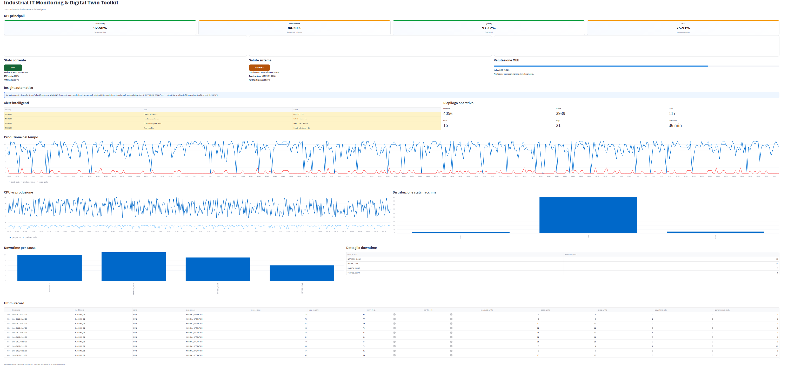

# Industrial IT Monitoring & Digital Twin Toolkit

Lightweight industrial monitoring and digital twin project built in Python.

---

## Dashboard Preview



---

## Overview

This project simulates a production machine and integrates:

- machine state simulation
- IT metrics simulation (CPU, RAM, network)
- industrial KPI calculation
- downtime analysis
- intelligent alert generation
- interactive Streamlit dashboard

The system demonstrates how IT conditions can directly impact industrial performance.

---

## Key Concept

The project follows a Digital Twin approach, where a simulated machine evolves over time and reacts to IT conditions such as system load, service availability, and network stability.

This allows analysis of how infrastructure behavior influences production efficiency.

---

## Project Structure

```
.
├── src/
│   └── simulator.py
├── data/
│   └── production_data.csv
├── dashboard/
│   └── app.py
├── screenshots/
│   └── dashboard.png
├── docs/
│   └── project_manual.md
├── README.md
├── requirements.txt
└── .gitignore
```
---

## Installation

Install dependencies:

pip install -r requirements.txt

---

## How to Run

Run the simulator:

python3 src/simulator.py

At startup, the simulator will ask you to choose the simulation mode:

1) Replicable (same data every run)
2) Variable (different data every run)

### Simulation Modes

Replicable mode:
- uses a fixed random seed
- generates identical data at each execution
- useful for documentation and reproducible analysis

Variable mode:
- uses a dynamic random seed
- generates different data at each execution
- useful for testing and scenario exploration

---

## Dashboard

Run the dashboard:

python3 -m streamlit run dashboard/app.py

Open in browser:

http://localhost:8501

---

## Output

The simulator generates the dataset:

data/production_data.csv

The file is overwritten at each run and is generated locally.

---

## Main KPIs

- Availability
- Performance
- Quality
- OEE (Overall Equipment Effectiveness)

---

## Purpose

This project demonstrates how IT conditions such as:

- CPU load
- network instability
- service availability

can directly impact industrial performance and production efficiency.

---

## Documentation

Full project manual available here:

docs/project_manual.md

---

## Technologies Used

- Python
- Pandas
- Streamlit

---

## Author

VektorBlock
